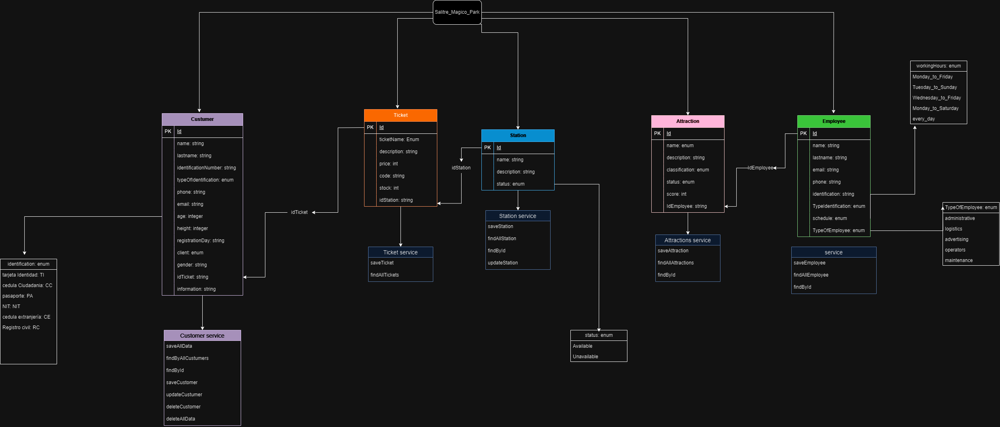
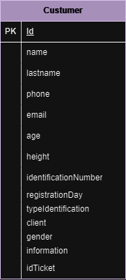
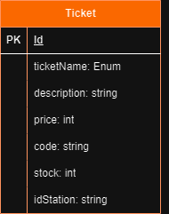
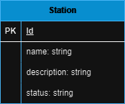
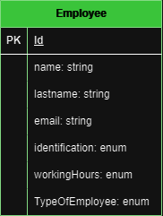
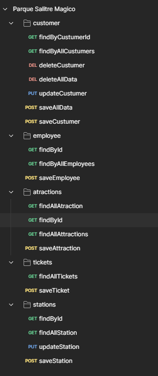

# Simulación parque Salitre Magico

## Ejecución del proyecto ✅:

_`Mongo db: localhost:27017`_
_`localhost:8080`_

Se utilizó Mongo Db por cuestión de rendimiento y comodidad a la hora de resolver la prueba. Como es una base de datos basada en documentos, ofrece más flexibilidad al almacenar los datos sin una estructura fija.

### Diagrama 🖥:

### Colecciones / Entidades 🧮

Para el diseño de la base de datos (MongoDB) se planteó un total de 5 colecciónes (Customer, Employee, Station, Ticket y Attraction).

A cada colección se le proporcionó los datos que se necesarios para realizar las operaciones del crud. Cuentan cada uno con un Id (String).

* **customer**
* 
  

customer cuenta con los datos basicos de información para un cliente que se visita el parque.

**Tipo de datos:**

| dato | tipo de dato | descripción |
| --- | --- | --- |
| Id | string | llave primaria |
| name | string | almacena el nombre del cliente|
| lastname | string | almacena el apellido del cliente |
| phone | string | almacena el numero de telefono del cliente|
| email | string | almacena el correo electronico del cliente |
| age | integer | almacena la edad del cliente para hacer validacion de acompañante en caso de ser menor de edad|
| height | integer | almacena la altura del cliente para validar si es apto para montar X atracción |
| identificationNumber | string | Numero de identificación del cliente |
| registrationDay | string | fecha de registro y entrada al parque de diversiones |
| typeIdentification | Enum | Tipo de identificación del cliente (CC, TE)|
| client | Enum | Puede ser (CHILD, YOUNG, ADULT, OLD MAN) |
| gender | Enum | (FEMALE, MALE, NO BINARY)|
| information | string | Valida si el usuario que ingreso al parque debe tener un acompañante|
| idTicket | string | (relación) Identificador de ticket, para tener información que tipo de tiquete se compra|

* **ticket**
* 
  

Ticket cuenta con la información que se le brinda a los usuarios cuando quieren comprar una entrada a X atracción.

**Tipo de datos:**

| dato | tipo de dato | descripción |
| --- | --- | --- |
| Id | string | llave primaria |
| ticketName| Enum | FAMILY, STANDAR, PLUS|
| description | string | almacena la descripción de cada tiquete |
| price | Integer | almacena el precio de cada tiquete|
| code | string | almacena un codigo de tiquete, diferente al id |
| stock | integer | Muestra cuantos tiquetes se encuentran para la venta|
| idStation | String | (relación) Identificador de en que estación se compro el tiquete |

* **station**
* 
  

**Tipo de datos:**

| dato | tipo de dato | descripción |
| --- | --- | --- |
| Id | string | llave primaria |
| name| string | FAMILY, STANDAR, PLUS|
| description | string | almacena la descripción de cada tiquete |
| status | Enum | almacena el precio de cada tiquete|

* **attraction**
* 
  

**Tipo de datos:**

| dato | tipo de dato | descripción |
| --- | --- | --- |
| Id | string | llave primaria |
| name| Enum |nombre de las atracciones disponibles en el parque: DRAKKO, MAGNUS, DOUBLE_LOOP, THE_TOP, HUNTED_HOUSE, KARTS, BOMBER_CARS,CAPITAL_WHEEL, SPLASH, CAROUSEL, CRAZY_PLANE, BABY_ZONE|
| description | string | descripción de la atracción |
| classification | Enum | Nivel de toleracia de cada atracción (CHILD, FAMILY, HIGH_IMPACT)|
| status | enum | Estado actual de cada atracción (AVAILABLE, UNAVAILABLE, IN_MAINTENANCE,REPAIR, WORKING, COMING_SOON) |
| score | integer | Muestra la puntuación que le dan los usuarios a cada atracción|
| idEmployee | String | (relación) Identificador para saber que empleado esta encargado de la atracción mecanica |

* **Employee**
* 
  

**Tipo de datos:**

| dato | tipo de dato | descripción |
| --- | --- | --- |
| Id | string | llave primaria |
| name | Enum | almacena el nombre de los empleados|
| lastName | string | almacena el apellido de los empleados |
| email | Integer | almacena el correo electronico de los empleados|
| phone | string | almacena el numero de telefono de los empleados |
| TypeIdentification | Enum | CC |
| identification | string | Numero de identificación de los empleados|
| shedule | Enum | Muestra los horarios de disponibilidad de los empleados (MONDAY_TO_WEDNESDAY_6_AM_TO_6_PM, MONDAY_TO_FRIDAY_6_AM_TO_4_PM,TUESDAY_TO_SUNDAY_8_AM_TO_4_PM,  WEDNESDAY_TO_FRIDAY_6_AM_TO_6_PM, EVERY_DAY_24_HRS) |
| TypeOfEmployee | Enum | cargos de los empleados del parque (ADMINISTRATIVE_EMPLOYEE, LOGISTICS_EMPLOYEE, ADVERTISING_EMPLOYEE, OPERATORS, MAINTENANCE_EMPLOYEES) |

### Dependencias del proyecto

      <?xml version="1.0" encoding="UTF-8"?>
            <project xmlns="http://maven.apache.org/POM/4.0.0
            " xmlns:xsi="http://www.w3.org/2001/XMLSchema-instance"
      xsi:schemaLocation="http://maven.apache.org/POM/4.0.0
      https://maven.apache.org/xsd/maven-4.0.0.xsd">

            <modelVersion>4.0.0</modelVersion>
            <parent>
                  <groupId>org.springframework.boot</groupId>
                  <artifactId>spring-boot-starter-parent</artifactId>
                  <version>3.1.8</version>
                  <relativePath/> <!-- lookup parent from repository -->
            </parent>
                  <groupId>com.co.linadev</groupId>
                  <artifactId>Salitre_Magico</artifactId>
                  <version>0.0.1-SNAPSHOT</version>
                  <name>Salitre_Magico</name>
            <description>Demo project for Spring Boot</description>
            <properties>
            <java.version>17</java.version>
            </properties>
            <dependencies>
                  <dependency>
                        <groupId>org.springframework.boot</groupId>
                        <artifactId>spring-boot-starter-data-mongodb</artifactId>
                  </dependency>
            <dependency>
                  <groupId>org.springframework.boot</groupId>
                        <artifactId>spring-boot-starter-web</artifactId>
            </dependency>

            <dependency>
                  <groupId>org.projectlombok</groupId>
                  <artifactId>lombok</artifactId>
                  <optional>true</optional>
            </dependency>
            <dependency>
                  <groupId>org.springframework.boot</groupId>
                  <artifactId>spring-boot-starter-test</artifactId>
                  <scope>test</scope>
            </dependency>
            </dependencies>

      <build>
            <plugins>
                  <plugin>
                  <groupId>org.springframework.boot</groupId>
                  <artifactId>spring-boot-maven-plugin</artifactId>
            <configuration>
                  <image>
                  <builder>paketobuildpacks/builder-jammy-base:latest</builder>
                  </image>
            <excludes>
                  <exclude>
                  <groupId>org.projectlombok</groupId>
                  <artifactId>lombok</artifactId>
                  </exclude>
            </excludes>
            </configuration>
                  </plugin>
            </plugins>
      </build>
      </project>

### Organización de carpetas del proyecto

`adapters`
* **controllers**
  - customerController
  - attractionController
  - ticketController
  - stationController
  - employeeController

`domain`
* **collections**
  - customer
  - attraction
  - ticket
  - station
  - employee

* **dto**
  - customerDto
  - attractionDto
  - ticketDto
  - stationDto
  - employeeDto

* **repository**
  - customerRepository
  - attractionRepository
  - ticketRepository
  - stationRepository
  - employeeRepository

* **utils**
  customer.json
  Messages

* **valueObject**
  - AttractionClassification
  - AttractionName
  - Gender
  - Status
  - TicketName
  - TypeIdentification
  - TypeOsclient
  - TypeOfEmployee
  - WorkingSchedule

`application`
* **mappers**
  - customerMapper
  - attractionMapper
  - ticketMapper
  - stationMapper
  - employeeMapper

* **service**

      **Interface**
      - customerInterface
      - attractionInterface
      - ticketInterface
      - stationInterface
      - employeeInterface

      **service**
      - customerService
      - attractionService
      - ticketService
      - stationService
      - employeeService

### Colección postman

## Autor ✒️
* **Lina María Guerrero López** - *linadev14* - [LinaDev14](https://github.com/LinaDev14)